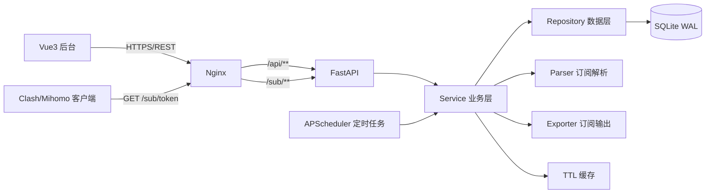
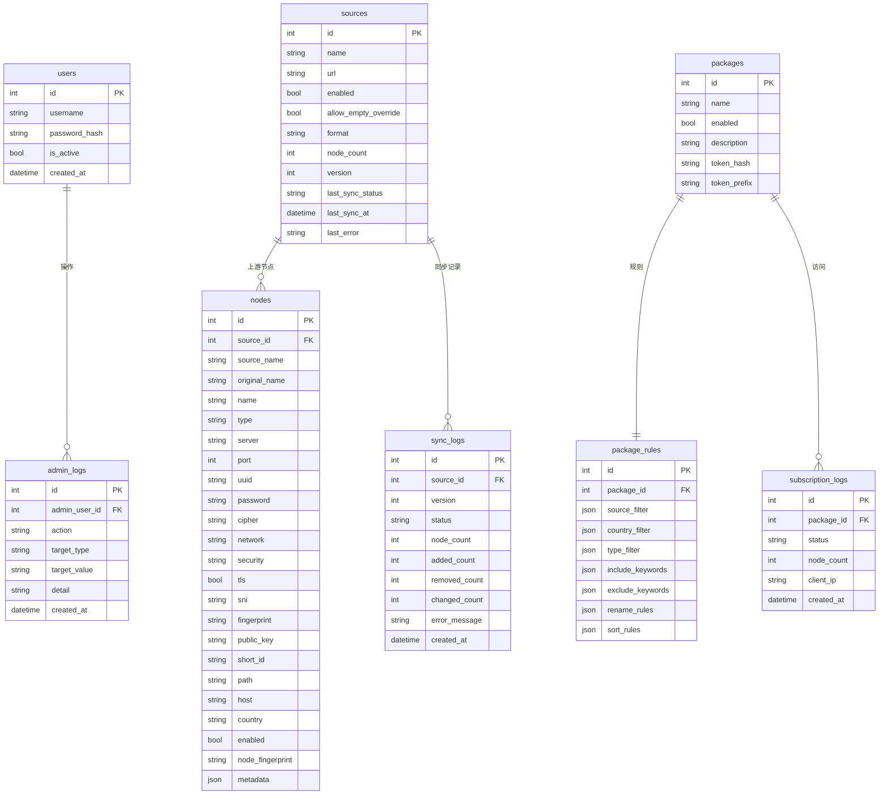

# 订阅聚合与节点分发系统：第一阶段设计与架构文档

## 1. 需求分析

### 1.1 核心目标

系统把多个合法授权的上游订阅解析后统一收进节点池，支持管理员添加自有 VLESS/SS 节点，再通过套餐规则对节点池做动态筛选、去重、重命名和排序，最后为每个套餐提供独立、固定、不可猜测的 Clash/Mihomo 订阅地址。

核心业务原则：

```text
上游订阅只是数据源
统一节点池才是核心数据
套餐只是节点池上的筛选规则
订阅 URL 只是套餐规则的对外访问入口
```

### 1.2 MVP 必须完成的功能

- 管理员登录（bcrypt 密码 + JWT 会话）
- 多个上游订阅的增删改查、启用/禁用、手动同步、自动同步
- 自动识别并解析 Base64 订阅、Clash YAML、VLESS/SS URI
- 所有节点标准化为统一 Node Model，写入统一节点池
- 添加自有 VLESS、Shadowsocks 节点
- 节点筛选：来源、地区、类型、包含关键词、排除关键词
- 节点去重：按连接信息生成指纹，避免简单按名称去重
- 节点重命名：前缀、后缀、关键词替换、国家名称替换、编号
- 节点排序：自定义顺序、国家、来源、名称
- 套餐系统：套餐只保存规则，不复制节点数据
- 每个套餐生成独立、高强度随机 Token，数据库只存 Token 哈希
- 输出 Clash/Mihomo YAML，且绝不包含上游订阅 URL
- 同步失败保留旧节点、同步事务化、保留同步版本
- 订阅响应使用缓存，上游同步成功后主动清理
- Web 后台（Vue3）与 REST API 前后端分离
- Docker Compose 一键部署 + Nginx + HTTPS 配置示例
- 单元测试与集成测试

### 1.3 MVP 明确不做

- 节点测速、延迟排序、自动优选（预留字段和排序扩展点）
- 流量统计、订阅访问统计（预留 subscription_logs 表）
- 用户管理、套餐过期、订阅限速（预留 users 表和扩展字段）
- Sing-box、Base64、V2Ray、Surge 输出（Exporter 架构预留）
- Kubernetes、Kafka、微服务等复杂技术

## 2. 技术可行性

### 2.1 推荐技术栈

| 层次 | 选型 | 理由 |
| --- | --- | --- |
| 后端 | Python 3.12 + FastAPI + Pydantic v2 | 类型安全、异步友好、自带 OpenAPI 文档 |
| ORM/迁移 | SQLAlchemy 2.0 + Alembic | 满足数据库迁移机制要求，SQLite/PostgreSQL 可切换 |
| 数据库 | SQLite（WAL 模式） | MVP 单实例足够，零运维，Docker 卷持久化 |
| 认证 | bcrypt + PyJWT | 密码不可逆存储，JWT 适合前后端分离 |
| HTTP 拉取 | httpx | 异步、超时、TLS 错误处理完善 |
| 定时任务 | APScheduler | 进程内定时同步，Docker 单 worker 下无重复执行 |
| 缓存 | cachetools（进程内 TTL） | MVP 不强制 Redis，降低部署复杂度；后续可替换 |
| 订阅解析 | 自研 app/parsers | 不把上游 URL 交给第三方 subconverter，隐私更可控 |
| 订阅输出 | 自研 app/exporters | 第一版只实现 Clash/Mihomo，架构支持扩展 |
| 前端 | Vue3 + Vite + Element Plus + Pinia | 与需求一致，后台管理界面成熟稳定 |
| 部署 | Docker Compose + Nginx | 满足一键部署，HTTPS 提供 Nginx 配置示例 |

### 2.2 本机环境检查结果

- Python 3.12.3、pip 24.2：可用
- Node.js 24.17.0：可用
- npm：PowerShell 执行策略拦截 `npm.ps1`，使用 `npm.cmd` 即可绕过
- Docker：本机未安装，不作为本地开发前置条件；Docker Compose 配置从项目第一天同步维护，在 Ubuntu VPS 部署时使用
- 当前仓库为空仓库，只有业务需求文档，无历史代码冲突

### 2.4 Windows 本地开发与 Docker 部署双轨策略

- 本地开发：Windows 直接运行 FastAPI（uvicorn）与 Vue3（Vite），不要求安装 Docker
- 生产部署：Ubuntu VPS 使用 Docker Compose + Nginx，配置随项目一起维护
- 所有脚本与路径尽量兼容 Windows/Linux，避免依赖 shell 专有语法
- SQLite 数据文件放在 `backend/data/`，本地与 Docker 均通过卷/目录持久化

### 2.3 主要风险与对策

| 风险 | 对策 |
| --- | --- |
| 上游格式差异大 | 独立 Parser 层 + 自动检测 + 每个 source 可手动指定格式 |
| 上游故障导致节点清空 | 同步采用 staging → validate → commit，失败保留旧节点 |
| 同步到一半崩溃 | 单事务提交，回滚不落脏数据 |
| 定时同步被多个 worker 重复执行 | Docker 使用单 worker；系统设置保留同步锁扩展点 |
| Token 被猜解 | 32 字节随机 Token，数据库只存 SHA-256 哈希 |
| 上游 URL 泄漏 | 订阅输出只生成解析后的 proxies，禁止 proxy-providers |
| SQLite 高并发写 | 开启 WAL，读写分离；同步频率默认 5 分钟，压力可控 |

## 3. 系统架构

### 3.1 分层架构



### 3.2 模块职责

- `api`：路由与请求参数校验，只做薄封装，不写业务逻辑
- `schemas`：Pydantic 请求/响应模型，字段校验与脱敏
- `services`：同步、节点、套餐、订阅、Token 等核心业务
- `repositories`：SQLAlchemy 数据访问，隔离 ORM 细节
- `parsers`：把 Base64/Clash/VLESS/SS 等格式转成统一 Node
- `exporters`：把 Node 列表转成 Clash/Mihomo YAML
- `tasks`：定时同步调度
- `core`：配置、安全、缓存、日志、异常处理
- `models`：SQLAlchemy ORM 模型
- `utils`：指纹生成、脱敏、国家识别等通用工具

### 3.3 关键设计决策

1. **解析器独立**：`app/parsers` 只负责“格式 → Node”，业务层不接触 VLESS URL、SS URL、Clash YAML 或 Base64。
2. **统一 Node Model**：数据库字段覆盖 VLESS、SS，并保留 VMess、Trojan、HTTP、SOCKS 扩展字段与 JSON metadata。
3. **套餐不复制节点**：`packages` + `package_rules` 只保存筛选/重命名/排序规则，订阅时动态计算。
4. **同步事务化**：拉取、解析、验证在内存完成，成功后在同一事务替换该 source 的旧节点。
5. **同步失败不清空**：任何 HTTP/解析/空内容异常都只更新失败状态和 sync_log，不触碰旧节点。
6. **Token 哈希存储**：订阅接口用 Token 查库，数据库不存明文 Token。
7. **订阅接口不触发上游同步**：用户请求只读节点池 + 缓存。
8. **缓存主动失效**：同步成功和套餐规则变更后清理相关缓存。
9. **日志脱敏**：UUID、SS 密码、完整 VLESS URL、上游 URL、Token 一律不写入日志。

## 4. 数据库 ER 设计

### 4.1 ER 图



### 4.2 表结构说明

#### users

管理员账号，MVP 阶段只做单个/少量管理员，角色字段预留。

#### sources

上游订阅源。`url` 是敏感凭证，只在后台 API 返回；`allow_empty_override` 表示管理员明确选择允许空订阅覆盖旧节点；`version` 是最近一次成功同步的版本号；`format` 支持 `auto/clash/base64/vless/ss`。

#### nodes

统一节点池。自有节点的 `source_id = NULL`，`source_name = '自有节点'`。`node_fingerprint` 根据协议、服务器、端口、UUID/密码、关键传输参数生成 SHA-256，唯一索引用于去重。`metadata` 为 JSON，支持未来协议扩展。

#### packages

套餐。`token_hash` 存 Token 的 SHA-256，`token_prefix` 只存前 8 位用于后台展示；不存明文 Token。

#### package_rules

套餐与规则 1:1。所有规则均为 JSON 数组/对象：

- `source_filter`：允许的来源名称列表，空数组表示全部
- `country_filter`：允许的地区列表，空数组表示全部
- `type_filter`：允许的类型列表，空数组表示全部
- `include_keywords`：名称必须包含的关键词
- `exclude_keywords`：名称必须排除的关键词
- `rename_rules`：`[{prefix, suffix, replacements:[{from,to}], country_map}]`
- `sort_rules`：`[{field: source|type|country|name, direction: asc|desc, order: [...]}]`

#### sync_logs

每次同步（成功或失败）都会写一条，用于追溯“昨天 100 个、今天 70 个”的问题。

#### subscription_logs

订阅请求日志，只记录 package_id、状态、节点数和 IP，不记录 Token。

#### admin_logs

管理员关键操作日志，如登录、新增/修改/删除、同步、Token 重生成。

#### system_settings

键值配置，用于同步间隔、去重来源优先级、国家名称映射等。

## 5. 项目目录结构

```text
sub项目/
├── backend/
│   ├── app/
│   │   ├── api/                  # 路由层
│   │   │   ├── admin.py          # 登录、管理员信息
│   │   │   ├── sources.py        # 上游订阅
│   │   │   ├── nodes.py          # 节点池与自有节点
│   │   │   ├── packages.py       # 套餐与规则
│   │   │   ├── logs.py           # 日志查询
│   │   │   ├── dashboard.py      # 概览统计
│   │   │   ├── subscribe.py      # GET /sub/{token}
│   │   │   └── deps.py           # 认证等公共依赖
│   │   ├── core/
│   │   │   ├── config.py         # 环境变量配置
│   │   │   ├── security.py       # bcrypt、JWT、Token 哈希
│   │   │   ├── cache.py          # TTL 缓存封装
│   │   │   ├── logging.py        # 日志与脱敏
│   │   │   └── exceptions.py     # 全局异常处理
│   │   ├── models/               # SQLAlchemy ORM
│   │   │   ├── base.py
│   │   │   ├── user.py
│   │   │   ├── source.py
│   │   │   ├── node.py
│   │   │   ├── package.py
│   │   │   ├── log.py
│   │   │   └── setting.py
│   │   ├── schemas/              # Pydantic 模型
│   │   │   ├── common.py
│   │   │   ├── auth.py
│   │   │   ├── source.py
│   │   │   ├── node.py
│   │   │   ├── package.py
│   │   │   └── log.py
│   │   ├── repositories/         # 数据访问
│   │   │   ├── source_repo.py
│   │   │   ├── node_repo.py
│   │   │   ├── package_repo.py
│   │   │   ├── log_repo.py
│   │   │   └── user_repo.py
│   │   ├── services/             # 业务逻辑
│   │   │   ├── auth_service.py
│   │   │   ├── source_service.py
│   │   │   ├── sync_service.py
│   │   │   ├── node_service.py
│   │   │   ├── package_service.py
│   │   │   ├── subscription_service.py
│   │   │   └── token_service.py
│   │   ├── parsers/              # 订阅解析
│   │   │   ├── base.py           # Parser 基类
│   │   │   ├── detector.py       # 格式自动检测
│   │   │   ├── base64_parser.py  # Base64 订阅
│   │   │   ├── clash_parser.py   # Clash YAML
│   │   │   ├── vless_parser.py   # 单行 VLESS URI
│   │   │   ├── ss_parser.py      # 单行 Shadowsocks URI
│   │   │   └── factory.py        # 按格式取解析器
│   │   ├── exporters/
│   │   │   ├── base.py           # Exporter 基类
│   │   │   └── clash.py          # Clash/Mihomo YAML
│   │   ├── tasks/
│   │   │   └── scheduler.py      # APScheduler 定时同步
│   │   ├── utils/
│   │   │   ├── fingerprint.py    # 节点指纹
│   │   │   ├── country.py        # 国家识别与映射
│   │   │   └── masking.py        # 敏感信息脱敏
│   │   ├── db.py                 # 数据库会话
│   │   ├── main.py               # FastAPI 入口
│   │   └── seed.py               # 初始化管理员
│   ├── alembic/                  # 数据库迁移
│   ├── tests/                    # pytest 测试
│   ├── requirements.txt
│   ├── .env.example
│   └── Dockerfile
├── frontend/
│   ├── src/
│   │   ├── api/                  # Axios 封装
│   │   ├── views/                # 登录、概览、订阅、节点、套餐、日志
│   │   ├── components/           # 通用组件
│   │   ├── stores/               # Pinia
│   │   ├── router/               # Vue Router
│   │   ├── App.vue
│   │   └── main.js
│   ├── package.json
│   ├── vite.config.js
│   └── Dockerfile
├── deploy/
│   └── nginx/
│       ├── nginx.conf            # HTTP 反代
│       └── ssl-example.conf      # HTTPS 配置示例
├── docker-compose.yml
├── .env.example
├── README.md
└── docs/
    └── 01-architecture.md
```

## 6. API 设计

### 6.1 通用约定

- 所有 `/api/admin/*`、`/api/sources/*`、`/api/nodes/*`、`/api/packages/*` 需要 `Authorization: Bearer <JWT>`
- `/sub/{token}` 与 `/healthz` 公开
- 分页参数统一为 `page`、`page_size`，返回 `{items, total, page, page_size}`
- 成功响应为标准 JSON；失败响应统一为 `{"detail": "人类可读错误信息"}`，不返回 Python traceback

### 6.2 管理员认证

| 方法 | 路径 | 说明 |
| --- | --- | --- |
| POST | `/api/admin/login` | 用户名+密码，返回 JWT |
| GET | `/api/admin/me` | 当前管理员信息 |
| PUT | `/api/admin/password` | 修改密码 |

### 6.3 上游订阅

| 方法 | 路径 | 说明 |
| --- | --- | --- |
| GET | `/api/sources` | 列表，支持 keyword/enabled |
| POST | `/api/sources` | 新增上游订阅 |
| GET | `/api/sources/{id}` | 详情（含脱敏后的 URL） |
| PUT | `/api/sources/{id}` | 修改 |
| DELETE | `/api/sources/{id}` | 删除，同时删除该源节点并写日志 |
| POST | `/api/sources/{id}/sync` | 手动立即同步，返回同步结果 |
| POST | `/api/sources/sync-all` | 同步全部启用源 |

### 6.4 节点池与自有节点

| 方法 | 路径 | 说明 |
| --- | --- | --- |
| GET | `/api/nodes` | 节点池列表，支持 source/type/country/keyword/enabled/分页 |
| POST | `/api/nodes` | 新增自有节点（VLESS/SS） |
| GET | `/api/nodes/{id}` | 节点详情 |
| PUT | `/api/nodes/{id}` | 修改节点 |
| DELETE | `/api/nodes/{id}` | 删除节点 |
| POST | `/api/nodes/batch` | 批量启用/禁用/删除 |

列表接口默认对 uuid、password、url 等敏感字段脱敏；详情接口仅认证管理员可见原文。

### 6.5 套餐与规则

| 方法 | 路径 | 说明 |
| --- | --- | --- |
| GET | `/api/packages` | 套餐列表（含 token_prefix、状态） |
| POST | `/api/packages` | 创建套餐，自动生成 Token |
| GET | `/api/packages/{id}` | 套餐详情与规则 |
| PUT | `/api/packages/{id}` | 修改名称/状态/规则 |
| DELETE | `/api/packages/{id}` | 删除套餐 |
| POST | `/api/packages/{id}/regenerate-token` | 重生成 Token，旧 Token 立即失效 |
| POST | `/api/packages/{id}/toggle` | 启用/禁用套餐 |
| GET | `/api/packages/{id}/preview` | 预览该套餐规则当前命中的节点 |

### 6.6 日志、概览与系统设置

| 方法 | 路径 | 说明 |
| --- | --- | --- |
| GET | `/api/logs` | 按 kind 查询 sync/subscription/admin/system 日志 |
| GET | `/api/dashboard/stats` | 上游数、节点数、自有节点数、套餐数、同步状态 |
| GET | `/api/system/settings` | 读取系统设置 |
| PUT | `/api/system/settings` | 修改同步间隔、去重优先级等 |

### 6.7 订阅与健康检查

| 方法 | 路径 | 说明 |
| --- | --- | --- |
| GET | `/sub/{token}` | 返回 Clash/Mihomo YAML，仅含解析后的节点 |
| GET | `/healthz` | 健康检查 |

## 7. 核心数据流

### 7.1 上游同步数据流

```text
定时任务 / 手动同步
      ↓
读取 source 配置（URL、格式、超时、allow_empty_override）
      ↓
HTTP 拉取（httpx，超时、TLS 校验）
      ↓
格式自动检测或按 source.format 指定
      ↓
Parser 解析为统一 Node 列表
      ↓
逐节点校验 + 指纹生成 + 内存中去重
      ↓
验证：空列表视为异常（除非 allow_empty_override=True）
      ↓
单个事务：删除该 source 旧节点 → 插入新节点 → 更新 source 状态/version
      ↓
写 sync_log（version、node_count、新增/删除/修改数）
      ↓
清理节点池与相关套餐缓存
```

失败路径：任何一步异常都只更新 source 的失败状态和 sync_log，旧节点原样保留。

### 7.2 订阅请求数据流

```text
GET /sub/{token}
      ↓
对 Token 做 SHA-256 查套餐（不存在或禁用则 404/403）
      ↓
检查缓存（套餐规则缓存 + 订阅 YAML 缓存，TTL 300 秒）
      ↓
命中 → 直接返回
      ↓
未命中 → 读取套餐规则 → 查询节点池
      ↓
执行筛选（来源/地区/类型/包含/排除关键词）
      ↓
去重（指纹）→ 重命名（规则）→ 排序（规则）
      ↓
Clash Exporter 生成 YAML
      ↓
写入缓存 → 记录 subscription_log → 返回
```

注意：该流程完全不访问上游 URL，也不触发同步。

### 7.3 管理员添加自有节点数据流

```text
Vue 表单
      ↓
POST /api/nodes
      ↓
Pydantic 校验（类型、server、port、必填协议字段）
      ↓
生成节点指纹并去重
      ↓
写入 nodes（source_id=NULL, source_name=自有节点）
      ↓
清理相关套餐缓存
```

### 7.4 套餐规则变更数据流

```text
PUT /api/packages/{id}
      ↓
更新 packages / package_rules
      ↓
写 admin_log
      ↓
清理该套餐订阅缓存
      ↓
下次订阅请求按新规则动态生成
```

## 8. 设计决策与待确认问题

### 8.1 已确定的默认值（将写入 README）

| 项目 | 默认值 | 原因 |
| --- | --- | --- |
| 同步周期 | 5 分钟 | 需求建议值 |
| 订阅缓存 TTL | 300 秒 | 需求建议值 |
| HTTP 超时 | 15 秒 | 避免上游拖垮同步 |
| JWT 有效期 | 12 小时 | 后台会话平衡安全与体验 |
| Token 长度 | `secrets.token_urlsafe(32)` | 高熵不可猜测 |
| 数据库 | SQLite + WAL | MVP 零运维 |
| uvicorn workers | 1 | 避免定时同步重复执行 |
| 国家识别 | 名称关键词映射 | 不引入 GeoIP 依赖 |
| 空订阅 | 默认视为异常 | 防止误清空，除非 allow_empty_override |

### 8.2 待确认问题与推荐方案

1. **订阅格式识别**：上游可能是 Base64、Clash YAML 或单行 URI。
   推荐：`auto` 自动检测，同时允许每个 source 手动指定 `format`，以 auto 为默认。

2. **国家识别**：需求要求按地区筛选，但上游节点通常只给名称。
   推荐：MVP 用名称关键词映射（香港/HK/Hong Kong/JP/日本等），后续版本再增加 GeoIP；映射表放系统设置，管理员可编辑。

3. **去重保留优先级**：需求示例为“自有节点 > 机场A > 机场B”。
   推荐：全局来源优先级列表存 system_settings，默认 `自有节点` 最优先，其余按来源创建顺序，管理员可调整。

4. **管理员初始化**：不写死账号密码。
   推荐：`.env` 提供 `ADMIN_USERNAME`、`ADMIN_PASSWORD`，首次启动自动创建管理员。

5. **缓存方案**：Redis 还是进程内缓存。
   推荐：MVP 用进程内 TTL 缓存，Docker Compose 不引入 Redis；后续需要多实例时再替换为 Redis。

6. **手动同步执行方式**：
   推荐：手动同步接口同步等待结果（返回同步统计），定时任务后台执行；单源最大等待约 15 秒，符合后台操作预期。

## 9. 第一阶段自检报告

### 已完成

- ✓ 需求分析：核心目标、MVP 边界、禁止简化的核心功能
- ✓ 技术可行性：本机环境检查、技术栈选型、风险与对策
- ✓ 系统架构：分层架构、模块职责、关键设计决策
- ✓ 数据库 ER：9 张表、关系、Node Model 完整字段
- ✓ 项目目录：后端/前端/部署三层结构，解析器与导出器独立
- ✓ API 设计：认证、订阅、节点、套餐、日志、订阅接口全覆盖
- ✓ 核心数据流：同步、订阅请求、自有节点、套餐规则四类数据流

### 需求对照

- ✓ 多上游订阅、自动同步、统一节点池
- ✓ 自有 VLESS/SS、筛选、去重、重命名、排序
- ✓ 套餐只存规则，不复制节点
- ✓ 独立随机 Token，数据库只存哈希
- ✓ Clash/Mihomo 输出，不暴露上游 URL
- ✓ 同步失败不清空、事务性、保留同步版本
- ✓ 管理员认证、前后端分离、模块化
- ✓ 缓存、日志、脱敏、异常处理
- ✓ 测试计划与最终验收流程已列入后续阶段

### 发现的问题

1. 本机未安装 Docker，第六阶段 Docker/Nginx 只能提供配置与静态检查，最终容器验证需要在 Docker 环境执行。
2. npm 在 PowerShell 下被执行策略拦截，前端依赖安装需使用 `npm.cmd`。
3. 依赖安装需要网络访问，进入代码阶段时可能需要临时批准网络。

## 10. 下一阶段

第二阶段计划：

1. 搭建 FastAPI + SQLAlchemy + Alembic 项目骨架
2. 创建数据库模型与初始迁移
3. 完成基础 API（健康检查、管理员登录、管理员信息）
4. 完成管理员认证（bcrypt + JWT + 依赖注入）
5. 编写基础测试并自检
